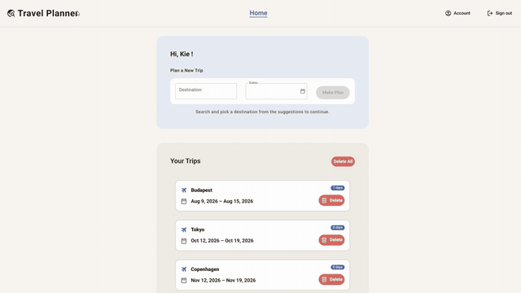

# Travel Planner

**English** · [日本語](README.ja.md)

A full-stack travel-planning web app that closes the gap between **"where"** and **"when"**. It turns a list of places you want to visit into a concrete, day-by-day itinerary by laying the schedule and the map side by side in one view. That way you can picture how far apart your destinations really are before you even arrive.

Built as my bachelor thesis project, applying Human-Computer Interaction (HCI), UI design, and Responsive Web Design principles to a working application.

## Demo



▶️ **[Watch the full walkthrough](https://github.com/user-attachments/assets/48251111-dd8f-48ab-8758-e6efaad24af7)**

## Why I built this

Planning a trip usually means bouncing between several apps: places saved in Google Maps, dates in a calendar, notes in yet another. The more places you save, the harder it gets to fit them into actual days. This app merges the map and the schedule into a single planning surface, so you can see *where* everything is while deciding *when* to go.

## Tech Stack

| Layer | Technology |
|---|---|
| Framework | [Next.js](https://nextjs.org) (App Router) - front end and server logic in one codebase |
| UI | React 19, plain CSS with a Material Design 3 token system (no UI library) |
| Database | [Turso](https://turso.tech) (libSQL, SQLite-compatible) in production; local `file:local.db` in development |
| Auth | NextAuth.js (credentials provider) + bcryptjs password hashing |
| Map & geocoding | Leaflet + OpenStreetMap tiles, Nominatim geocoding via a server-side proxy |
| Drag & drop | dnd-kit |
| Date picking | react-day-picker |
| Testing / CI | Vitest unit tests, GitHub Actions |

## Features

- **Trip creation**: Pick a destination (OpenStreetMap autocomplete) and a date range; the "Make Plan" button stays disabled until both are valid, so you can't start with missing information.
- **Weekly schedule table**: columns are generated automatically from the trip's duration. Activities are draggable cells sized on a 30-minute grid and color-coded by category; accommodations render as bars spanning their check-in/check-out dates.
- **Drag & drop rescheduling with Undo**: dragging a cell updates the database asynchronously; a drop that would overlap another activity is rejected and returns to its origin with an explanation, and every edit offers an Undo via toast.
- **Day view**: One day's activities sorted by start time next to a Leaflet map. Each activity with an address gets a numbered pin; hovering a card highlights its pin, keeping schedule and map in sync. A per-day memo auto-saves on blur.
- **Guest mode**: Plan a full trip without an account (stored in localStorage, with a persistent banner explaining the trade-off). On sign-up, the guest plan is imported into the new account so no work is lost.
- **Account management**: Profile editing, password change with a live requirement checklist, and account deletion behind deliberate friction (collapsed "danger" section + password re-entry + confirmation dialog).
- **Validation on both sides**: overlap and time-range rules are enforced in the client *and* re-checked on the server before writing, so the schedule stays consistent even if a client-side check is bypassed.
- **Status visibility everywhere**: loading states on buttons, an offline banner ("changes can't be saved right now" / "Back online"), saving indicators, and empty states with a clear next action.

## Design & Engineering Highlights

### Material Design 3 via design tokens

The entire visual language is a small MD3 design system implemented as CSS custom properties in [tokens.css](src/app/styles/tokens.css) — every component consumes tokens, never raw values:

- **Color roles**: `--md-primary` (ink blue) for positive actions, `--md-error` (red) for destructive ones, a tonal `--md-secondary-container` for secondary actions, and surface/on-surface pairs, each mapped to semantic aliases (`--color-text`, `--color-bg-card`, …) so components stay decoupled from the palette.
- **Type scale**: Roboto with MD3 roles (headline / title / body) encoded as size + line-height + letter-spacing token triplets.
- **Shape & elevation**: pill buttons (`--shape-full`), 12dp cards, 28dp modals, and a three-level layered shadow scale instead of heavy drop-shadows.
- **State layers & motion**: MD3 hover/focus/press opacities and standard easing/duration tokens; all animation respects `prefers-reduced-motion`.
- **Accessibility baked into the tokens**: a 48dp minimum touch target token, `html { font-size: 62.5% }` with rem units so the layout scales with the user's browser font setting (WCAG 1.4.4), high-contrast focus rings, and a skip link for keyboard users.

### HCI principles as concrete UI decisions

- **Gulf of Execution / Evaluation (Norman)**: disabled-until-valid primary buttons act as constraints; SPA routing and instantly updated table headers confirm each action without a reload.
- **Nielsen's heuristics**: Every modal traps focus, closes on Escape/Cancel, and warns before discarding unsaved changes; destructive actions require confirmation; toasts offer Undo ("user control and freedom").
- **Cognitive load**: Activities are chunked by day (Miller's Law) and details are hidden behind progressive disclosure: compact cards in the weekly view, full cards in the day view, everything else one click away in a modal.
- **Thumb Zone ergonomics**: On mobile, the primary "Add activity" action collapses into a floating action button in the bottom-right natural zone for one-handed reach.

### Responsive strategy (desktop-first)

Planning happens on a laptop; checking the plan happens on a phone mid-trip. The layout is designed for desktop first and adapted down:

| Breakpoint | Device | Layout |
|---|---|---|
| ≥ 1025px | Desktop | Two-pane split: schedule 40% / map 60% |
| 641–1024px | Tablet | Map on top with a minimum height, scrolling list below |
| ≤ 640px | Mobile | Single-column stack, FAB for the primary action |

Travel-specific problems get dedicated solutions: the weekly table keeps its day-by-day structure on phones via a horizontally scrollable container instead of stacking columns, and the map sits in a fixed-height block so a downward swipe scrolls the page rather than getting trapped panning the map.

### Data model

Relational schema ([schema.sql](schema.sql)) built on one-to-many relationships: a user owns trips; a trip owns activities, day memos, and accommodations. Foreign keys use `ON DELETE CASCADE`, so deleting a trip cleanly removes everything under it, no orphaned records. Passwords are stored only as bcrypt hashes.

The project started on a local SQLite file (better-sqlite3) and was migrated to libSQL/Turso for deployed, multi-device access, the schema carried over unchanged, which validated the original relational design.

## Getting Started

### Prerequisites

- Node.js 20+

### Setup

```bash
# 1. Install dependencies
npm install

# 2. Configure environment variables
cp .env.example .env
```

Edit `.env`:

```bash
# Generate with: openssl rand -base64 32
NEXTAUTH_SECRET=<your-secret>
NEXTAUTH_URL=http://localhost:3000

# Optional — leave empty for local dev (falls back to a local SQLite file)
TURSO_DATABASE_URL=
TURSO_AUTH_TOKEN=
```

```bash
# 3. Create the database schema (uses file:local.db when Turso vars are empty)
npm run db:migrate

# 4. Start the dev server
npm run dev
```

Open [http://localhost:3000](http://localhost:3000). You can start planning immediately in guest mode, or sign up for a persistent account.

### Using Turso in production

```bash
turso db show <db> --url          # -> TURSO_DATABASE_URL
turso db tokens create <db>       # -> TURSO_AUTH_TOKEN
npm run db:migrate                # applies schema.sql to the remote DB
```

### Scripts

| Command | Description |
|---|---|
| `npm run dev` | Start the development server |
| `npm run build` | Production build |
| `npm start` | Serve the production build |
| `npm test` | Run unit tests (Vitest) — validation and overlap logic |
| `npm run lint` | ESLint |
| `npm run db:migrate` | Apply `schema.sql` to the configured database |

## Limitations & Future Work

- Geocoding relies on the public Nominatim endpoint (rate-limited); production use would need a dedicated provider.
- Offline edits are detected (banner) but not yet buffered — a PWA mode with sync-on-reconnect is the planned next step.
- Further ideas: collaborative real-time itineraries, place recommendations, route optimization between scheduled stops, dark theme, and localization.
